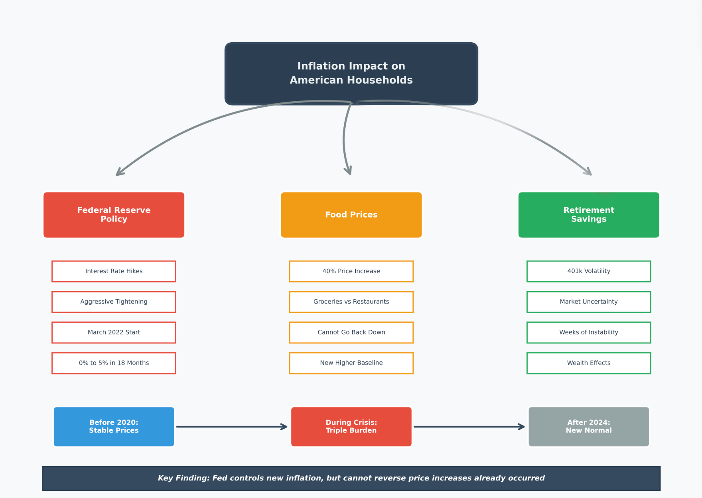

## Project Overview

{fig-align="center" width="90%"}

This research examined one of the most significant economic events in recent American history: the 2022 inflation crisis and its aftermath. By analyzing data from 2010 through 2024, we uncovered how this crisis affected ordinary families through three distinct but interconnected channels—food costs, spending choices, and retirement savings. What we found challenges the common assumption that "things will go back to normal" once inflation cools down.

---

## What Actually Happened: The 2022 Inflation Story

In early 2022, American families faced a perfect storm. Prices were rising at rates not seen since the 1980s, with overall inflation peaking at 9.1% in June 2022. The Federal Reserve responded with the most aggressive interest rate increases in modern history, raising rates from nearly zero to over 5% in just 18 months. This was the monetary policy equivalent of slamming on the brakes.

The immediate goal—stopping runaway inflation—was achieved. By late 2024, headline inflation had cooled to around 3%. But our analysis reveals a more complex and troubling reality underneath these headline numbers. While the Federal Reserve successfully prevented inflation from spiraling out of control, the damage to household budgets had already been done. Food prices, which are the most visible and frequent expenses for families, increased by 40% during this period. That grocery bill that used to be $500 per month? It became $700, and our data shows it is not going back down.

This is where the story gets more interesting—and more concerning. We discovered that this was not just about higher prices at the grocery store. Families faced three simultaneous pressures that compounded each other, creating what we call the "triple burden."

---

## The Triple Burden: Three Ways Families Feel the Squeeze

### Channel One: Your Grocery Bill Jumped 40% and Stayed There

The most direct impact was on food costs. Between 2020 and 2024, the price index for food consumed at home rose from approximately 250 to over 310—a 40% increase that represents one of the sharpest rises in modern history. But here is the critical finding: these prices did not come back down when overall inflation cooled.

This phenomenon, which economists call the "ratchet effect," means that each economic crisis pushes prices to a new, higher level where they remain permanently. Unlike energy prices that can spike and then fall, food prices exhibit what our data shows as extremely strong persistence—when they go up, they stay up. For a typical middle-class family spending $6,000 annually on groceries in 2019, that budget needs to be $8,400 today to buy the same items. This is not a temporary belt-tightening situation; it is a permanent reallocation of family income.

### Channel Two: You Cannot Escape by Dining Out

When grocery prices rise, a logical response might be to eat out more at restaurants with fixed menu prices, or vice versa. Our analysis reveals that this strategy does not work because restaurant prices actually rose faster than grocery prices—projected to increase 4.8% annually compared to 3.7% for groceries. This happens because restaurants are labor-intensive businesses, and wages have been rising along with everything else.

What this means in practice is that families have no escape valve. If you try to save money by cooking more at home, you face 40% higher grocery costs. If you decide that is too much work and eat out more, you face even steeper price increases. The data shows no evidence that consumers are successfully shifting between these categories to save money. Both channels are hitting household budgets simultaneously, with grocery price increases actually leading restaurant price increases by about 1-4 months.

### Channel Three: Your Retirement Account Became a Roller Coaster

The third and perhaps least obvious impact is on retirement savings and financial security. Our analysis of Treasury Inflation-Protected Securities (TIPS)—investments specifically designed to protect against inflation—revealed a troubling pattern. Rather than providing stability during high inflation periods, these assets became more volatile, not less.

Each time new inflation data was released or the Federal Reserve announced rate changes, financial markets experienced sustained periods of instability lasting approximately 18 days. For families with 401k retirement accounts, this meant watching their balances swing up and down week after week throughout 2022 and 2023. While younger workers might view this as abstract, families approaching retirement found themselves suddenly uncertain about whether they could actually afford to stop working.

This creates psychological stress beyond just dollars and cents. Financial advisors call this the "dual burden"—you are spending more on daily necessities while simultaneously watching your safety net become less predictable. Our analysis shows these two effects occurred simultaneously and persisted for months, creating compounding stress rather than isolated shocks.

---

## Why This Time Is Different: The New Normal

Perhaps the most important finding from this research is that we are not returning to pre-pandemic price levels. Ever. The data makes this abundantly clear through several different lenses.

First, the trend analysis shows that food price growth has permanently shifted to a higher trajectory. Before 2020, food prices grew at 2-3% annually. Our forecasts project 3-4% annual growth going forward—a seemingly small difference that compounds significantly over time. A household that spent $500 monthly on food in 2019 needs $700 today and will need $726 by the end of 2025, $753 by 2026, and so on. The baseline has been permanently reset 40% higher.

Second, the mechanisms driving food inflation have changed. Before the pandemic, food prices were primarily driven by predictable factors like seasonal harvests and gradual productivity improvements. Now, they are driven by supply chain restructuring costs, elevated transportation expenses, higher labor costs due to tighter labor markets, and increasing climate volatility affecting agricultural production. These are not temporary disruptions—they are structural changes to how our food system operates.

Third, the Federal Reserve's tools are poorly suited to address this type of inflation. Interest rate policy works by reducing demand—making borrowing expensive so people buy less. But you cannot really reduce demand for food below a certain level. People need to eat. When inflation is driven by supply-side problems (farms, factories, trucks, workers), demand-side solutions (higher interest rates) have limited effectiveness. The Fed can prevent food inflation from accelerating further, but it cannot bring prices back down to 2019 levels.

---

## What This Means for Different Groups

### For Working Families

The practical implication is straightforward but sobering: household budgets need permanent restructuring. That extra $200 per month going to groceries is not a temporary pandemic expense you can eliminate when "things get back to normal." It is the new normal. Families need to find an additional $2,400 annually in their budgets, permanently, just to maintain the same standard of living they had in 2019.

This has cascading effects. Money that might have gone to saving for college, building an emergency fund, or contributing extra to retirement is instead going to buy the same groceries you bought before. The financial planning advice that worked in the 2010s—save 10-15% of income, maintain 3-6 months emergency fund—becomes harder to follow when a larger share of income must go to non-discretionary food expenses.

### For Retirees and Near-Retirees

People on fixed incomes or approaching retirement face an especially challenging situation. A retirement plan based on 2019 cost assumptions is now underfunded by approximately 15-20% for food expenses alone. Someone who planned to spend $800 monthly on food in retirement now needs $1,120 just for food, before considering other inflated costs like healthcare and housing.

Moreover, the increased volatility in financial markets means that the traditional "sequence of returns risk"—the danger of retiring right before a market downturn—has been amplified. The sustained periods of market instability we identified mean that retirement account balances are less predictable precisely when retirees need them to be most stable.

### For Policymakers

Our findings suggest that traditional inflation targeting may be necessary but insufficient. The Federal Reserve's 2% inflation target focuses on preventing new inflation, but does nothing to address the 40% price level increase that already occurred. Families do not care whether new inflation is 2% or 4%—they care that eggs cost $4 instead of $2 and are not going back.

Effective policy responses need to address:
- Supply-side constraints in food production and distribution
- Labor market dynamics driving service sector inflation  
- Financial market volatility that compounds household stress
- The distributional impacts of inflation that hurt low-income families most

Simply declaring victory because headline inflation fell from 9% to 3% misses the lived experience of families dealing with permanently higher costs and reduced financial security.

### For Researchers and Analysts

This research demonstrates the critical importance of integrating multiple analytical perspectives. Looking only at Federal Reserve policy misses the food price dynamics. Looking only at food prices misses the financial market effects. Looking only at statistical models misses the human impact.

The "triple burden" framework we identified—simultaneous pressure on consumption, blocked substitution, and wealth volatility—only became visible by combining macroeconomic policy analysis, consumer behavior modeling, and financial market volatility analysis. Future research on inflation's impacts should adopt this multi-dimensional approach to capture the full scope of how economic shocks affect real people.

---

## Looking Forward: What Comes Next

Our forecast models project that food inflation will continue at 3-4% annually for the foreseeable future, elevated above the 2-3% pre-pandemic average. This is not catastrophic—it is not the 8-15% rates seen in 2021-2022—but it is also not a return to the old normal.

Several scenarios could alter this trajectory. Climate change impacts on agriculture could push food inflation higher. Technological improvements in food production could potentially bring costs down, though our data shows little evidence of this so far. Government policy interventions targeting specific bottlenecks in the food supply chain could help at the margins.

But absent major changes, American families should plan for a future where food costs 40% more than it did five years ago and continues rising 3-4% annually from that elevated baseline. Financial planning, household budgeting, and policy design all need to account for this new reality rather than expecting a return to 2019 conditions.

---

## Final Reflections

This research began with a simple question: how did the 2022 inflation crisis affect American households? The answer proved more nuanced and troubling than anticipated. Yes, the Federal Reserve successfully prevented runaway inflation. Yes, headline numbers have improved dramatically. But underneath those aggregate statistics, millions of families face permanently higher costs, fewer options to adjust their spending, and greater uncertainty about their financial futures.

The "triple burden"—simultaneous pressure on food budgets, blocked escape routes through substitution, and volatile retirement savings—represents a new economic reality that will shape American life for years to come. Understanding this reality, rather than waiting for a return to "normal" that is not coming, is the first step toward effective adaptation at both the household and policy levels.

Perhaps most importantly, this research demonstrates that inflation is not just a number reported in the news—it is a lived experience that touches every aspect of family finances, from weekly grocery shopping to long-term retirement planning. The real measure of inflation's impact is not whether the CPI falls from 9% to 3%, but whether families can afford the same quality of life they had before. By that measure, the 2022 inflation crisis created lasting damage that rate cuts and cooling headlines cannot undo.

The challenge now is to build economic policies, financial strategies, and household budgets that acknowledge this new baseline rather than yearning for a past that no longer exists. Only by clear-eyed recognition of what has changed can we chart effective paths forward.

---
